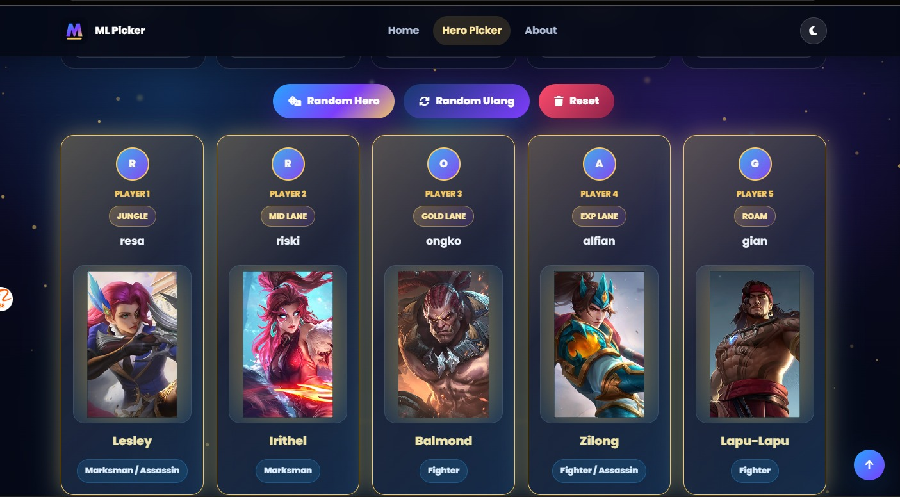

# 🎮 Mobile Legends Random Hero Picker


Website sederhana bertema **Mobile Legends** yang dibuat menggunakan **HTML5, CSS3, dan Vanilla JavaScript** tanpa framework.

Aplikasi ini membantu pemain Mobile Legends memilih hero secara acak untuk **5 pemain** dengan tampilan modern, animasi menarik, dan pengalaman seperti draft pick.

---

# 🌐 Live Demo

**Demo Website**

[https://username.github.io/mobile-legends-random-hero-picker/](https://picker-hero-ml.vercel.app/)

**Repository**

https://github.com/kingdhet12/Picker_Hero_ML


---

# 📸 Preview




---

# ✨ Features

## 🎮 Hero Random Picker

- Input 5 Nama Player
- Random Hero untuk seluruh pemain
- Hero tidak boleh duplikat
- Random Ulang
- Reset Semua

---

## 👥 Player Card

Setiap pemain memiliki card berisi:

- Avatar Player
- Nama Player
- Hero Image
- Hero Name
- Hero Role
- Glassmorphism Effect
- Gold Border
- Glow Animation

---

## 🎲 Random System

Menggunakan:

- JavaScript Random Generator
- Fisher-Yates Shuffle Algorithm

Fitur:

- Hero tidak akan terpilih dua kali dalam satu sesi.
- Hero muncul satu per satu setelah animasi selesai.

---

## 🎨 Modern UI

- Mobile Legends Theme
- Glassmorphism Card
- Gradient Button
- Neon Glow Effect
- Shadow Effect
- Modern Typography
- Google Font (Poppins)
- Font Awesome Icon

---

## ⚡ Animation

- Shuffle Animation
- Flip Animation
- Scale Animation
- Glow Effect
- Fade In
- Hero Reveal Animation
- Loading Spinner
- Ripple Button Effect

---

## 🌌 Background

- Mobile Legends Arena
- Blur Overlay
- Canvas Particle Animation

---

## 📱 Responsive Design

Optimized for

- Desktop
- Laptop
- Tablet
- Smartphone

Layout

Desktop

```
5 Card
```

Tablet

```
2-3 Card
```

Mobile

```
1 Card
```

---

# 📂 Project Structure

```
Mobile-Legends-Random-Hero-Picker
│
├── index.html
├── style.css
├── script.js
├── README.md
│
└── assets
    ├── heroes
    │     ├── miya.png
    │     ├── layla.png
    │     ├── ling.png
    │     └── ...
    │
    ├── background
    │     ├── bg.jpg
    │     └── preview.png
    │
    ├── icons
    │
    └── sounds
          └── click.mp3
```

---

# 🛠 Technologies

- HTML5
- CSS3
- Vanilla JavaScript (ES6)
- Google Fonts
- Font Awesome

No Framework

No Bootstrap

No React

No Vue

No Backend

---

# 📋 Hero List

Minimal berisi **50 Hero Mobile Legends**.

Contoh:

- Miya
- Layla
- Tigreal
- Saber
- Franco
- Akai
- Balmond
- Alucard
- Karina
- Hayabusa
- Ling
- Fanny
- Lancelot
- Gusion
- Beatrix
- Claude
- Moskov
- Wanwan
- Brody
- Granger
- Melissa
- Xavier
- Valentina
- Joy
- Novaria
- Cici
- Zhuxin
- Lukas
- dan lainnya.

---

# 🎯 Hero Random Rules

✅ Hero tidak boleh sama

✅ Semua hero dipilih secara acak

✅ Setiap sesi random menghasilkan kombinasi berbeda

✅ Random menggunakan Fisher-Yates Shuffle

---

# 🎮 User Flow

```
Input Nama Player
        │
        ▼
Klik Random Hero
        │
        ▼
Animasi Shuffle
        │
        ▼
Loading
        │
        ▼
Hero Muncul Satu per Satu
        │
        ▼
Semua Hero Terpilih
```

---

# 🚀 Getting Started

Clone repository

```bash
git clone https://github.com/kingdhet12/Picker_Hero_ML.git
```

Masuk ke folder project

```bash
cd Picker_Hero_ML
```

Jalankan

Buka file

```
index.html
```

langsung menggunakan browser.

Tidak membutuhkan:

- NodeJS
- NPM
- Database
- Server
- Build Process

---

# 🎮 Available Buttons

| Button | Function |
|----------|----------|
| 🎲 Random Hero | Memilih hero secara acak |
| 🔄 Random Ulang | Mengacak ulang seluruh hero |
| 🗑 Reset | Menghapus semua hasil |
| ⬆ Back To Top | Kembali ke atas halaman |

---

# 📌 Future Improvements

Fitur yang dapat ditambahkan

- Ban Hero
- Pick Role
- Team Merah vs Team Biru
- Draft Pick Mode
- Export Hasil Pick
- Save History
- Voice Effect
- Background Music
- Hero Filter berdasarkan Role
- Hero Search
- Hero Counter Recommendation
- Multiplayer Mode
- Dark Mode Auto
- API Hero Mobile Legends
- Leaderboard
- Tournament Mode

---

# 📄 License

Project ini dibuat untuk tujuan pembelajaran, demonstrasi, dan portofolio.

Seluruh aset Mobile Legends seperti nama hero, logo, dan gambar merupakan hak cipta pemiliknya masing-masing dan digunakan hanya sebagai contoh implementasi antarmuka.

---

# 👨‍💻 Author

**Resa Erlangga**

💼 E-Commerce Operation Specialist

💻 Web Developer

🎨 UI/UX Enthusiast

📧 Email

your@email.com

🐙 GitHub

https://github.com/kingdhet12

🌐 Portfolio

https://kingdhet12.github.io

💼 LinkedIn

https://linkedin.com/in/resaerlangga

---

# ⭐ Support

Apabila project ini bermanfaat,

jangan lupa memberikan ⭐ **Star** pada repository GitHub ini.

Semoga project ini dapat membantu pemain Mobile Legends menentukan hero secara acak dengan pengalaman yang lebih seru dan menyenangkan.
